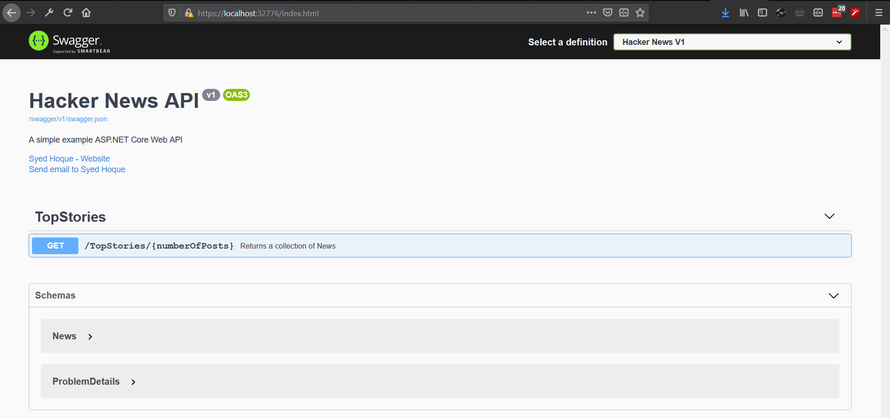

# HackerNewsDemo

Please ensure you have: 

 - docker desktop 2.2 or higher running
 - .net core 3.1 runtime installed: https://dotnet.microsoft.com/download
 - target c# 8.0 as language (if you have .net core 3.1 installed Visual Studio will take care of it)
 - run on Visual Studio 2019 16.4.3 or higher
 
 Build and run
 
 
 
